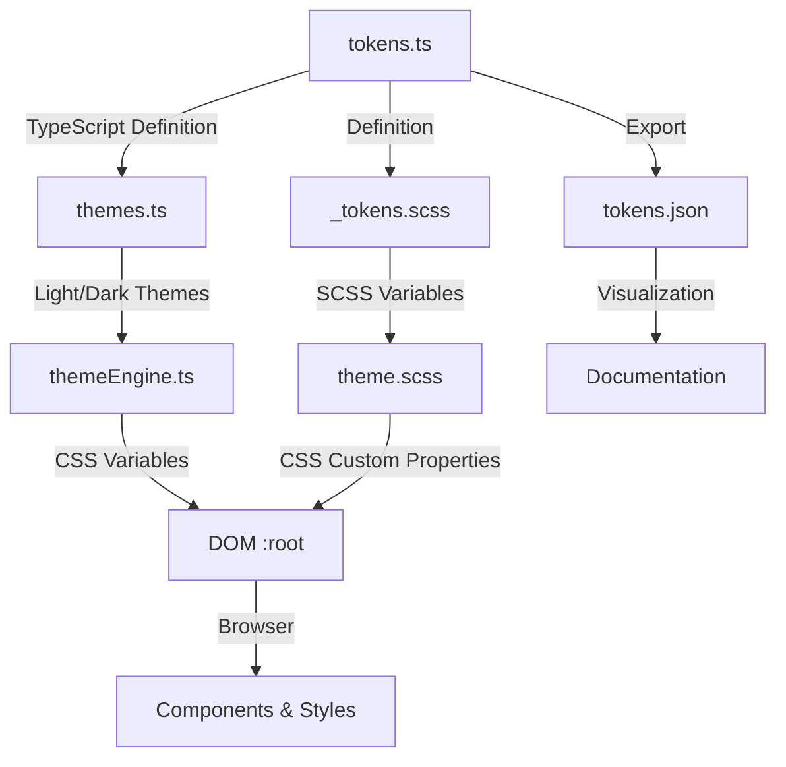

# DashForge Design System - Material Design 3

Comprehensive design tokens system aligned with **Material Design 3** specifications.

## Overview

DashForge includes a complete Material Design 3 token system that covers:

- **30+ Colors** (primary, secondary, tertiary, error, neutral, surface)
- **13 Typography Styles** (display, headline, title, body, label)
- **6 Spacing Levels** (4px-based scale)
- **7 Border Radius Values** (corner system)
- **6 Elevation Levels** (shadows)
- **3 Transition Durations** (animations)

All tokens are defined in TypeScript, exported as JSON, and available as CSS custom properties.

## File Structure

```
src/theme/
├── tokens.ts          # Material Design 3 token definitions (source of truth)
├── themes.ts          # Light and dark theme variations
├── themeEngine.ts     # Theme application and CSS variable generation
└── types/
    └── theme.ts       # TypeScript interfaces for themes

src/styles/
├── _tokens.scss       # SCSS variables (compiled from tokens.ts)
├── theme.scss         # CSS variable definitions and utilities
└── dark.scss / light.scss  # Theme-specific overrides

docs/design-system/
├── tokens.json        # Exported tokens (generated)
└── index.html         # Documentation site (generated)
```

## Token Organization

### Light Theme (Default)

```typescript
import { lightTheme } from '@/theme/themes'

lightTheme.colors.primary // #6750a4 (Purple)
lightTheme.colors['on-primary'] // #ffffff (White)
lightTheme.spacing.md // 16px
lightTheme.typography['title-large'] // { fontSize: '22px', fontWeight: 500, ... }
```

### Dark Theme

```typescript
import { darkTheme } from '@/theme/themes'

darkTheme.colors.primary // #d0bcff (Light Purple)
darkTheme.colors['on-primary'] // #371e55 (Dark Purple)
```

## Usage

### 1. In Vue Components (TypeScript)

```vue
<script setup lang="ts">
import { lightTheme, darkTheme, applyTheme } from 'dashforge-ui'

// Apply light theme
applyTheme(lightTheme)

// Or apply dark theme
applyTheme(darkTheme)

// Import material tokens
import { materialTokens } from 'dashforge-ui'
const primaryColor = materialTokens.light.primary
</script>

<template>
  <div class="my-card">
    <h2>Card Title</h2>
    <p>Content here</p>
  </div>
</template>
```

### 2. In CSS/SCSS

```scss
.my-card {
  // Colors
  background-color: var(--df-color-surface);
  color: var(--df-color-text);
  border: 1px solid var(--df-color-outline);
  
  // Spacing
  padding: var(--df-spacing-lg);
  margin-bottom: var(--df-spacing-md);
  
  // Shape
  border-radius: var(--df-corner-medium);
  
  // Elevation
  box-shadow: var(--df-elevation-1);
  
  h2 {
    // Typography
    font-size: var(--df-font-size-title-large);
    font-weight: var(--df-font-weight-medium);
    margin-bottom: var(--df-spacing-md);
  }
  
  p {
    font-size: var(--df-font-size-body-medium);
    line-height: 1.5;
  }
}
```

### 3. SCSS Utilities (Predefined Classes)

Use pre-defined typography classes:

```vue
<template>
  <div>
    <h1 class="df-display-large">Display Large</h1>
    <h2 class="df-headline-large">Headline Large</h2>
    <h3 class="df-title-large">Title Large</h3>
    <p class="df-body-medium">Body Medium</p>
    <button class="df-label-large">Button Label</button>
  </div>
</template>
```

### 4. Programmatic Theme Switching

```typescript
import { lightTheme, darkTheme, applyTheme, mergeThemes } from 'dashforge-ui'

// Apply a theme
const isDark = window.matchMedia('(prefers-color-scheme: dark)').matches
applyTheme(isDark ? darkTheme : lightTheme)

// Listen for system theme changes
window.matchMedia('(prefers-color-scheme: dark)').addEventListener('change', (e) => {
  applyTheme(e.matches ? darkTheme : lightTheme)
})

// Create a custom theme variant
const customTheme = mergeThemes(lightTheme, {
  colors: {
    primary: { base: '#FF6B00', 'on-base': '#FFFFFF' }
  },
  spacing: {
    md: '18px'
  }
})

applyTheme(customTheme)
```

## Automatic Documentation

### Generate Documentation

```bash
npm run gen:docs
```

This creates:
- `docs/design-system/tokens.json` - All tokens in JSON format
- `docs/design-system/index.html` - Interactive documentation website

### View Documentation

Open `docs/design-system/index.html` in your browser to browse the complete design system.

## Component Showcase

\`\`\`vue
<script setup lang="ts">
import { DesignSystemShowcase } from 'dashforge-ui'
</script>

<template>
  <DesignSystemShowcase />
</template>
\`\`\`

This component displays all tokens with interactive samples.

## Design System Architecture



## Spacing Scale

Based on 4px base unit (Material Design standard):

| Token | Value | Usage |
|-------|-------|-------|
| `--df-spacing-xs` | 4px | Icon spacing, extra small gaps |
| `--df-spacing-sm` | 8px | Button padding, small gaps |
| `--df-spacing-md` | 16px | Component margins, standard gaps |
| `--df-spacing-lg` | 24px | Section spacing, large gaps |
| `--df-spacing-xl` | 32px | Extra large gaps |
| `--df-spacing-2xl` | 48px | Page sections, maximum gaps |

## Typography Scale

13 distinct typography roles for different content needs:

- **Display** (3 sizes): Large headlines and banner text
- **Headline** (3 sizes): Section headers
- **Title** (3 sizes): Subsection headers and cards
- **Body** (3 sizes): Paragraph and content text
- **Label** (3 sizes): Buttons, tags, badges

Each style includes: font-size, font-weight, line-height, and letter-spacing.

## Color System

### Tonal System (Material Design 3)

Each color has multiple variants:

- **Base**: Primary color
- **On Base**: Text/content color on the base
- **Container**: Lighter variant for backgrounds
- **On Container**: Text color on container

### Color Roles

- **Primary**: Brand color (default: Purple #6750a4)
- **Secondary**: Supporting color (default: Purple Gray #625b71)
- **Tertiary**: Complementary accent (default: Pink #7d5260)
- **Error**: For error states (Red #b3261e)
- **Neutral**: Grayscale colors
- **Surface**: UI surfaces (backgrounds)
- **Outline**: Borders and dividers

## Dark Mode Integration

Dark theme is automatically available through:

1. **CSS Media Query**: `prefers-color-scheme: dark`
2. **Programmatic**: `applyTheme(darkTheme)`
3. **Manual Toggle**: Create custom theme variants

All color tokens are redefined in dark theme for optimal contrast and WCAG AA compliance.

## Best Practices

1. **Use Token Variables**: Always use `--df-color-*`, `--df-spacing-*`, etc. instead of hardcoded values
2. **Maintain Consistency**: Use the provided typography classes (`.df-title-large`, `.df-body-medium`)
3. **Respect Spacing Scale**: Stick to provided spacing values for consistent layouts
4. **Accessibility**: All color combinations meet WCAG AA standards
5. **Theme Switching**: Use `applyTheme()` for dynamic theme changes

## Customization

To modify tokens:

1. **Edit** `src/theme/tokens.ts`
2. **Update** `src/theme/themes.ts` to use new values
3. **Regenerate** `src/styles/_tokens.scss` (or update manually)
4. **Run** `npm run gen:docs` to update documentation

## Related Documentation

- [Material Design 3 Specifications](https://m3.material.io/)
- [TOKENS.md](../TOKENS.md) - Detailed token reference
- [Design System Component](../src/components/DesignSystemShowcase/DesignSystemShowcase.vue)

## API Reference

### `applyTheme(theme: Theme)`

Applies a theme by setting CSS custom properties on the document root.

```typescript
import { lightTheme, applyTheme } from 'dashforge-ui'
applyTheme(lightTheme)
```

### `mergeThemes(base: Theme, partial: PartialTheme)`

Recursively merges a partial theme into a base theme.

```typescript
const customTheme = mergeThemes(lightTheme, {
  colors: { primary: { base: '#FF0000' } }
})
```

### `generateCSSVars(theme: Theme)`

Generates a record of all CSS variable values for a theme.

```typescript
const vars = generateCSSVars(lightTheme)
// { '--df-color-primary': '#6750a4', ... }
```

## FAQ

**Q: Can I customize the Material Design 3 colors?**
A: Yes! Edit `src/theme/tokens.ts` and create your own theme variant using `mergeThemes()`.

**Q: Are the tokens compatible with Figma?**
A: Yes! The JSON export can be imported into Figma using Tokens Studio plugin.

**Q: How do I use custom fonts?**
A: Update `$df-font-family` in `src/styles/_tokens.scss` and rebuild.

**Q: Do the colors meet accessibility standards?**
A: Yes! All color combinations are tested for WCAG AA contrast ratios.
